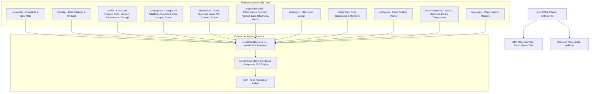

# Dynalektric Enterprise Architecture Overview

## Executive Summary
This document outlines the software architecture and system design of the Dynalektric frontend platform. The architecture follows clean enterprise separation-of-concerns principles while guaranteeing 100% backward compatibility for browser script execution, static site prerendering, and SEO search indexation.

---

## High-Level System Architecture

---

## Core Architectural Layers

1. **Config Layer (`src/config/`)**
   - Site settings, SEO meta, constants (colors, routes, breakpoints, page defaults).
2. **Data Layer (`src/data/`)**
   - Pure JS data catalogs (`products.js`, `industries.js`, `certifications.js`, `caseStudies.js`).
3. **Lib Layer (`src/lib/`)**
   - Framework-agnostic utilities (`dom`, `browser`, `performance`, `storage`).
4. **Adapters Layer (`src/adapters/`)**
   - Integration interfaces isolating external contracts (`analytics`, `forms`, `images`, `export`).
5. **Services Layer (`src/services/`)**
   - Async business services handling network operations (`api.js`, `contactService.js`, `exportService.js`).
6. **Performance Architecture (`src/performance/`)**
   - Performance controllers (`lazy.js`, `preload.js`, `observers.js`, `metrics.js`).
7. **Logging & Error Layer (`src/logger/`, `src/errors/`)**
   - Centralized error boundaries, error handlers, and loggers.
8. **Components & Feature Modules (`src/components/`, `src/pages/`)**
   - Reusable React UI components and domain pages.

---

## Global Compatibility Contract
To preserve legacy HTML script inclusion order (`tweaks-panel.js` → `shared.js` → `header.js` → `page-*.js` → `app.js`), the common module `src/components/common/shared.jsx` attaches exported data sets and components onto the `window` global (`window.PRODUCTS`, `window.INDUSTRIES`, `window.useReveal`, etc.).
