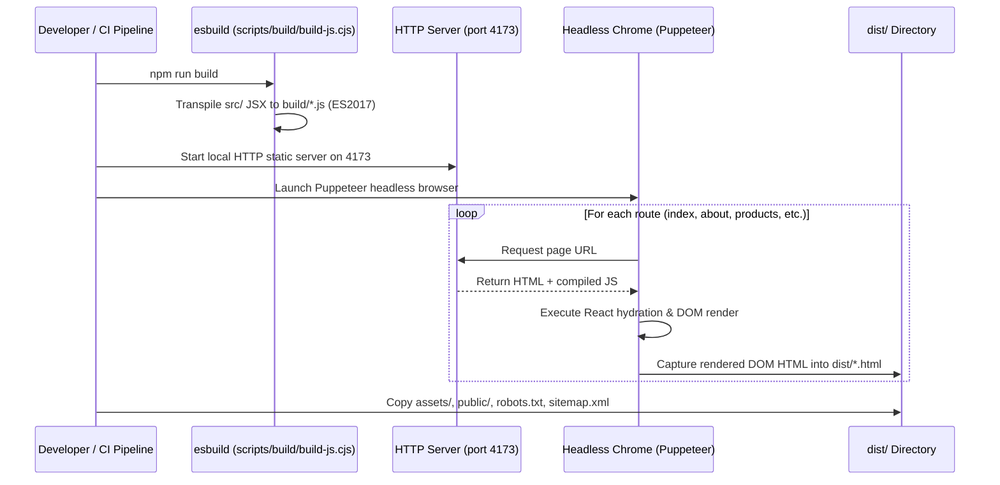

# Dynalektric Build Pipeline Documentation

## Overview
The Dynalektric build system is designed for high-performance static site generation (SSG) without modifying browser runtime behavior or SEO metadata.

---

## Build Steps

---

## Script Commands

- `npm run clean`: Removes existing `build/` artifacts.
- `npm run build:js`: Runs `esbuild` transpile on all source JSX files into `build/*.js`.
- `npm run build:staging`: Builds staging output with `BUILD_MODE=staging` (`robots.txt: Disallow /`).
- `npm run build:production`: Builds production output with `BUILD_MODE=production` (`robots.txt: Allow /`).
- `npm run build`: Full production clean, transpile, and static prerender into `dist/`.
